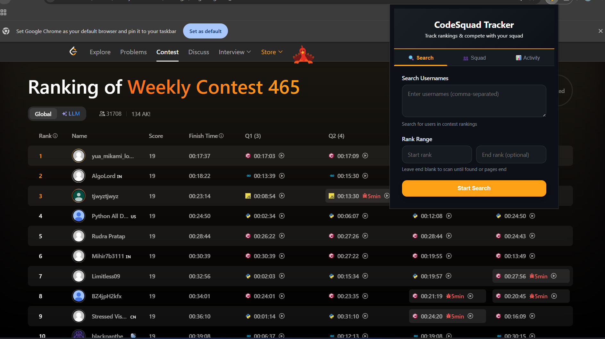

# CodeSquad Tracker 🏆

**Track LeetCode contest rankings, build your coding squad, and compete with friends!**

CodeSquad Tracker is a Chrome extension that enhances your LeetCode competitive programming experience by allowing you to search for users in contest rankings, manage a squad of friends, and track performance with a leaderboard.

---

## ✨ Features

### 🔍 **Smart Contest Search**

-   Search for specific usernames within LeetCode contest rankings
-   Define custom rank ranges to narrow your search
-   Fuzzy matching to find similar usernames
-   Direct links to user profiles
-   **NEW:** Add found users directly to your squad!

### 👥 **Squad Management**

-   Build and manage your coding squad
-   Add friends by username with validation
-   Quick access to friend profiles
-   Visual friend list with avatars

### 🏆 **Performance Leaderboard**

-   Track total problems solved by difficulty (Easy/Medium/Hard)
-   See rankings among your squad members
-   Medal system for top performers (🥇🥈🥉)
-   Real-time stats via LeetCode's GraphQL API

---

## 📸 Preview



---

## 📥 Installation

### From Source

1. Clone or download this repository:

```bash
git clone https://github.com/MUHSIN-M-P/leetcode-rank-search-extension.git
```

Or download the ZIP and extract it.

### 2. Load into Chrome

1. Open Chrome and go to: `chrome://extensions`
2. Enable **Developer Mode** (top right toggle)
3. Click **Load unpacked**
4. Select the `leetcode-rank-search-extension/` folder

---

## 🧠 How to Use

1. Navigate to a LeetCode contest rank page like:

    ```
    https://leetcode.com/contest/weekly-contest-455/ranking/
    ```

2. Click the extension icon in your toolbar
3. Click **“Start User Search”**
4. Enter one or more LeetCode usernames (comma-separated)
   🚨 Do pass UserNames as shown the ranking not UserIds
5. A floating dialog appears showing progress
6. When users are found, their page numbers are displayed

You can also:

-   🔄 Click **Search Again** to rerun
-   🛑 Click **STOP** to cancel mid-search
-   ❌ Click the close button to hide the dialog

---

> 🚨 **Heads Up!**  
> If you see the error:
>
> 🧱 **“Rank page not found”**
>
> It means the extension couldn’t detect the contest ranking table.
>
> ✅ **Quick Fix:** Just **reload the contest page** and try again.  
> This usually happens because LeetCode loads some content dynamically, and a manual refresh helps the script detect the correct elements.

---

## 🧾 File Structure

```
leetcode-rank-search-extension/
├── manifest.json           # Extension configuration
├── popup.html     # Main UI with tabs
├── popup.css      # Professional styling
├── popup.js       # Squad & leaderboard logic
├── content.js             # Contest search & page interaction
├── popup.html             # Legacy popup
├── popup.js               # Legacy script
├── background.js          # Service worker
├── icon16.png             # Toolbar icons
├── icon48.png
└── icon128.png
```

## ⚠️ Limitations

-   Uses **unofficial** LeetCode GraphQL API (may break with changes)
-   Leaderboard shows all-time stats (not contest-specific)
-   Rate limiting may apply with many friends
-   Requires internet connection for GraphQL queries

---

## 🤝 Contributing

Feel free to submit issues or pull requests to improve CodeSquad Tracker!

---
